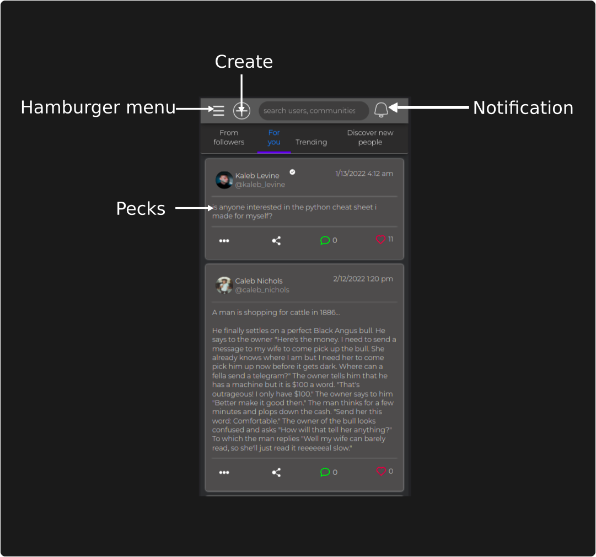
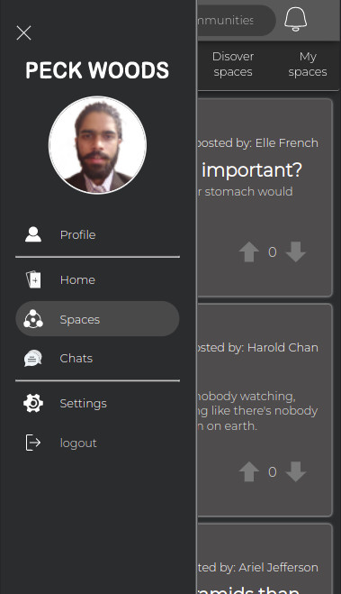
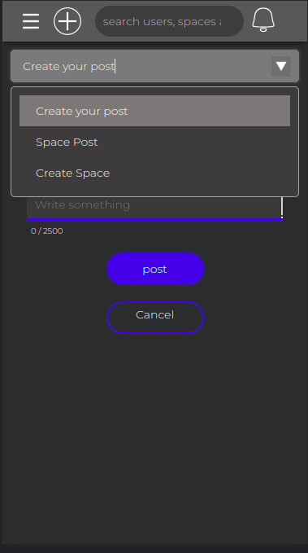

# Peckspace
- Spaces for everyone

### **Interface:**

* Click on Hamburger menu to navigate, To create a new peck(/post) click on create icon. 

### **Hamburger menu:**

### **Creating a Peck:**

You can post two different kind of Peck, one User peck to post your day-to-day updates, other Space pecks, where you can share your work and inspire others

Click on drop-down to choose the kind of Peck you want to post

* Click on post once you are happy with your post.

### **Joining a space**

You can join spaces either by searching for the space or through our "Discover spaces" or by creating one by yourself.

### **Chat**

To have a private conversition with a user, you need to click on the 3 dots on their profile and click on send message. 
> Note: If user has disabled anyone can message, only the people user follows will be able to text them. 
